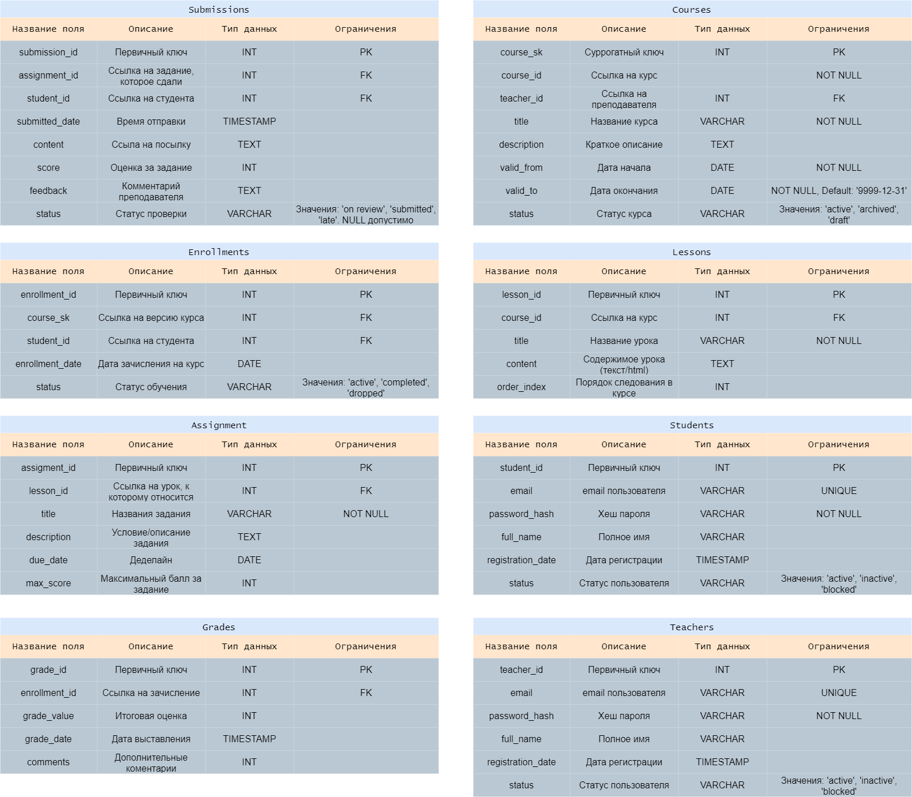

## О проекте

Данный проект представляет собой платформу для онлайн обучения. В папке `docs` находятся концептуальная, логическая и физическая модели.
Скрипты для создания таблицы в `scripts`, а примеры использования в `scripts/examples`

Инструменты: PostgreSQL (пока что)

Все таблицы удовлетворяют 3НФ

В таблице **courses** реализован **SCD 2**, в остальных таблицах **SCD 1**

### Пояснения к физической модели



1) submissions.status принимает значения 'on review', 'submitted', 'late'
2) courses.status принимает значения 'active', 'archived', 'draft'
3) enrollments.status принимает значения 'active', 'completed'
4) students.status принимает значения 'active', 'inactive', 'blocked'
5) teachers.status принимает значения 'active', 'inactive', 'blocked'

### Как запускать и проверять проект

Запустите DDL-скрипт `create_schema.sql` для создания таблиц

Например:
```psql -d mydb -U postgre -f create_schema.sql```

Вставьте данные через DML-скрипты - `inserts.sql`

Например:
```psql -d mydb -U postgre -f inserts.sql```

Ожидаемый результат:
- После выполнения `create_schema.sql` без ошибок создаётся структура.
- После `inserts.sql` в таблицах появляется учебный набор данных.

Если вы создаете таблицы не через предоставленный скрипт, то рекомендуется порядок: **teachers** → **students** → **courses** → **enrollments** → **grades** → **lessons** → **assignments** → **submissions**. Так внешние ключи уже будут существовать, и вставка не провалится.

#### Проверка:
 - Запустите примеры запросов
 - Убедитесь, что результат согласуется с логикой (ниже логика)

### Что делает каждый пример (кратенько):

1. Выводит список студентов на активных курсах
2. Выводит сколько зачислений у каждого (логического) курса, где учится >=5 студентов
3. Выводит преподавателей, чьи курсы никогда не были 'archived' (т.е. не закрывались. можно, например, выписать премию :) )
4. Выводит преподавателей, которые не ведут активных курсов
5. Выводит рейтинг студентов в каждом (логическом) курсе за всю историю существования того или иного курса
6. Выводит топ 5 студентов, с самым высоким средним баллом за курсы
7. Выводит уроки, у которых меньше 2-х заданий
8. Выводит все курсы и сколько у них уроков за всю историю (даже если у курса нет уроков)
9. Выводит пары студентов, у которых дата регистрации в системе отличается не более чем на день
10. Вывести всех, кто набрал строго больше студента X по каждому предмету


## Где можно использовать

Данная схема может быть прототипом базы данных онлайн площадок для обучения (прохождения курсов) или LMS
